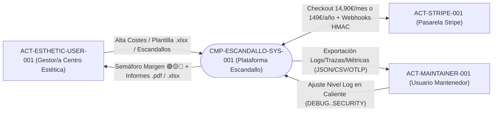
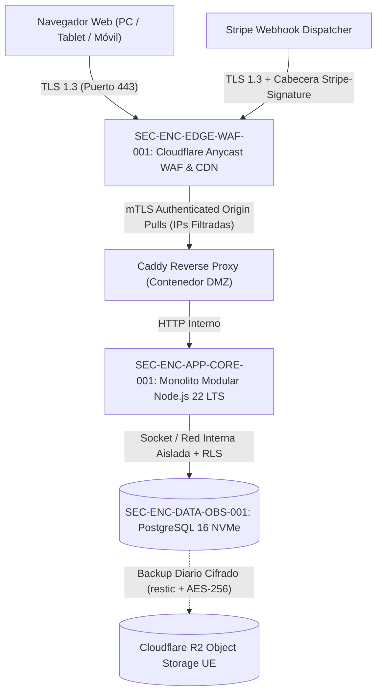

# 03. Context and Scope (arc42 Sec. 3 / NAF Operational)

## 1. Business Context

Modela las fronteras conceptuales e intercambios de información entre la plataforma **Escandallo** y sus actores externos.

### 1.1 Business Context Diagram

### 1.2 Operational Information Exchanges (`OIE-*`)

| Exchange ID | Source / Target | Payload / Message | Protocol / Channel | Format |
| :--- | :--- | :--- | :--- | :--- |
| `OIE-USER-WEB-001` | `ACT-ESTHETIC-USER-001` $\leftrightarrow$ `CMP-ESCANDALLO-SYS-001` | Gestión de centros, catálogo de costes, recetas dinámicas `M3`, simulación de PVP `M2` e histórico | HTTPS (TLS 1.3) / REST | JSON (Validado con Zod) |
| `OIE-REPORT-DOC-002` | `ACT-ESTHETIC-USER-001` $\leftrightarrow$ `CMP-DOC-IO-001` | Subida de plantilla de catálogo (`.xlsx`) y descarga de informes ejecutivos (`.pdf`, `.xlsx`) | HTTPS Streaming | OOXML (`.xlsx`) / PDF 1.7 (`.pdf`) |
| `OIE-STRIPE-BILL-003` | `CMP-BILLING-STRIPE-001` $\leftrightarrow$ `ACT-STRIPE-001` | Creación de sesiones Checkout/Portal y recepción asíncrona de eventos de pago | HTTPS / Webhook HMAC-SHA256 | JSON (`Stripe-Signature`) |
| `OIE-MAINT-OBS-004` | `ACT-MAINTAINER-001` $\leftrightarrow$ `CMP-OBS-TELEMETRY-001` | Cambio en caliente de nivel de log y exportación de telemetría redactada | HTTPS / OTLP | JSON / CSV / OTLP |

---

## 2. Technical Context and Perimeter Infrastructure

### 2.1 Technical Context Diagram

---

## 3. Revision History and Version Control

| Version | Date | Author / Agent | Change Description | Change Reference (Change/PR) |
| :--- | :--- | :--- | :--- | :--- |
| **1.0.0** | 2026-10-05 | agent-system-architect | Definición inicial de contexto de negocio y técnico | ARCH-INIT-001 |
