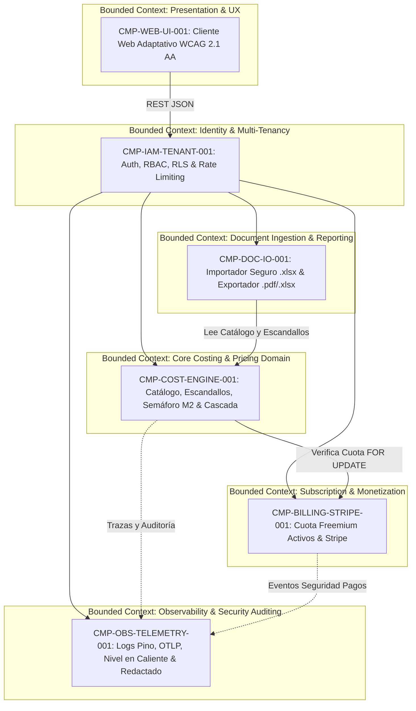

# 05. Building Blocks View: Level 1 Whitebox (arc42 Sec. 5 / NAF Services & Systems)

## 1. Overall System Decomposition (Level 1 & Level 2)

Presenta la descomposición del sistema raíz `CMP-ESCANDALLO-SYS-001` en sus seis subsistemas modulares de Nivel 2, alineados con sus respectivos Bounded Contexts de Domain-Driven Design (DDD).

### 1.1 Level 1 Whitebox Diagram

---

## 2. Bounded Contexts and Components Catalog (`CMP-*`)

| Bounded Context | Component ID | Level | Enclave | Implemented Use Cases (`UC-*`) | Satisfied Requirements (`FR-*` / `QR-*` / `SEC-REQ-*`) |
| :--- | :--- | :---: | :--- | :--- | :--- |
| **Escandallo SaaS Platform** | [`CMP-ESCANDALLO-SYS-001`](./components/cmp-escandallo-sys-001.md) | 1 | `SEC-ENC-APP-CORE-001` | Todos (`UC-COST-CATALOG-001` a `UC-OBSERVABILITY-001`) | Todos (`FR-*`, `QR-*`, `SEC-REQ-*`) |
| **Presentation & UX** | [`CMP-WEB-UI-001`](./components/cmp-web-ui-001.md) | 2 | `SEC-ENC-EDGE-WAF-001` | Todos (`UC-COST-CATALOG-001` a `UC-OBSERVABILITY-001`) | `QR-UI-A11Y-001`, `FR-COST-001`, `FR-CALC-001`, `FR-REPORT-001`, `FR-OBS-001` |
| **Identity & Multi-Tenancy** | [`CMP-IAM-TENANT-001`](./components/cmp-iam-tenant-001.md) | 2 | `SEC-ENC-APP-CORE-001` | `UC-COST-CATALOG-001`, `UC-OBSERVABILITY-001` | `FR-TENANT-001`, `QR-SEC-001`, `SEC-REQ-TENANT-001`, `SEC-REQ-DOS-001`, `SEC-REQ-OBS-001` |
| **Core Costing & Pricing** | [`CMP-COST-ENGINE-001`](./components/cmp-cost-engine-001.md) | 2 | `SEC-ENC-APP-CORE-001` | `UC-COST-CATALOG-001`, `UC-ESCANDALLO-CALC-001` | `FR-COST-001`, `FR-CALC-001`, `FR-HIST-001`, `SEC-REQ-TENANT-001`, `SEC-REQ-DOS-001` |
| **Document Ingestion & Reporting** | [`CMP-DOC-IO-001`](./components/cmp-doc-io-001.md) | 2 | `SEC-ENC-APP-CORE-001` | `UC-COST-CATALOG-001`, `UC-EXEC-REPORT-001` | `FR-COST-001`, `FR-REPORT-001`, `SEC-REQ-XLSX-001`, `SEC-REQ-DOS-001`, `SEC-REQ-TENANT-001` |
| **Subscription & Monetization** | [`CMP-BILLING-STRIPE-001`](./components/cmp-billing-stripe-001.md) | 2 | `SEC-ENC-APP-CORE-001` | `UC-ESCANDALLO-CALC-001`, `UC-SUBSCRIPTION-001` | `FR-BILLING-001`, `QR-SEC-001`, `SEC-REQ-BILLING-001` |
| **Observability & Auditing** | [`CMP-OBS-TELEMETRY-001`](./components/cmp-obs-telemetry-001.md) | 2 | `SEC-ENC-DATA-OBS-001` | `UC-OBSERVABILITY-001` | `FR-OBS-001`, `QR-SEC-001`, `SEC-REQ-OBS-001` |

---

## 3. Revision History and Version Control

| Version | Date | Author / Agent | Change Description | Change Reference (Change/PR) |
| :--- | :--- | :--- | :--- | :--- |
| **1.0.0** | 2026-10-05 | agent-system-architect | Definición inicial de bloques de construcción Nivel 1 y Nivel 2 | ARCH-INIT-001 |
