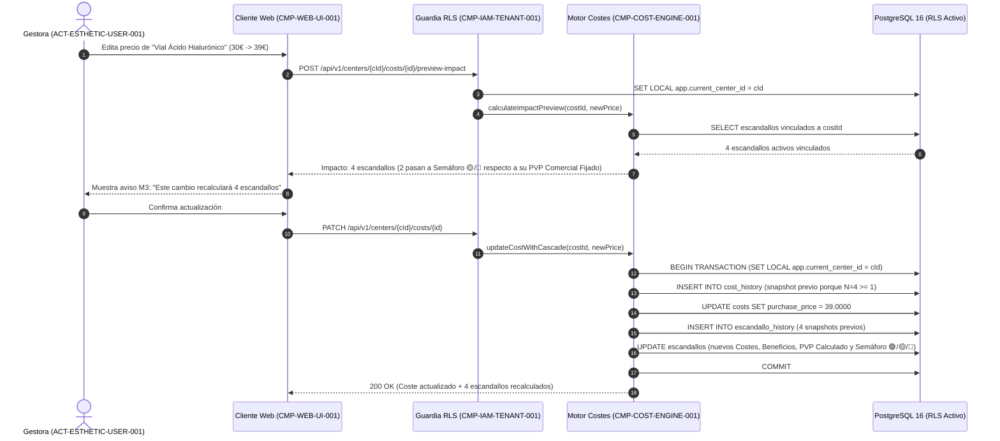
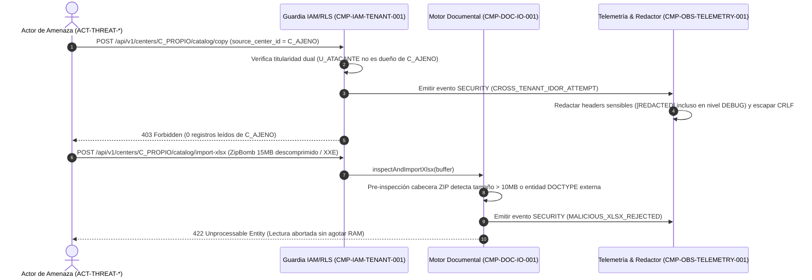

# 06. Runtime View (arc42 Sec. 6 / NAF Behaviour)

## 1. Nominal Scenario: Previsualización de Impacto (M3), Actualización de Coste y Recálculo en Cascada (`SEQ-CASCADE-RECALC-001`)

Describe la interacción dinámica cuando una gestora modifica el precio de compra de un cosmético o el sueldo de un empleado, visualiza cuántos escandallos se verán afectados (`M3`) y confirma la actualización atómica con evaluación del Semáforo de Erosión de Margen (`M2`).



---

## 2. Nominal & Security Scenario: Control Atómico de Cuota Freemium y Suscripción Stripe (`SEQ-QUOTA-STRIPE-002`)

Modela la serialización con `SELECT ... FOR UPDATE` para impedir condiciones de carrera sobre el límite de 2 escandallos `active` (`SEC-REQ-BILLING-001`) y la activación verificada mediante webhook de Stripe.

```mermaid
sequenceDiagram
    autonumber
    actor User as Gestora (ACT-ESTHETIC-USER-001)
    participant IAM as Guardia RLS (CMP-IAM-TENANT-001)
    participant Bill as Módulo Billing (CMP-BILLING-STRIPE-001)
    participant DB as PostgreSQL 16
    participant Stripe as Stripe (ACT-STRIPE-001)

    User->>IAM: POST /api/v1/centers/{cId}/escandallos (Intento de 3er escandallo activo)
    IAM->>Bill: enforceQuotaAndCreate(cId, payload)
    Bill->>DB: BEGIN; SELECT subscription_status FROM centers WHERE id = cId FOR UPDATE
    Bill->>DB: SELECT COUNT(*) FROM escandallos WHERE center_id = cId AND status = 'active'
    DB-->>Bill: active_count = 2, subscription_status = 'free'
    Bill->>DB: ROLLBACK
    Bill-->>User: 402 Payment Required (Opciones: Archivar 1 activo [M1] o Suscribirse 14,90€/mes | 149€/año)
    User->>Bill: POST /api/v1/centers/{cId}/billing/checkout (Plan Mensual 14,90 EUR)
    Bill->>Stripe: Crear Checkout Session (metadata: center_id=cId)
    Stripe-->>User: Redirección a pasarela de pago Stripe
    Stripe->>Bill: POST /api/v1/billing/webhooks/stripe (Stripe-Signature HMAC-SHA256)
    Bill->>Bill: Verifica firma HMAC y ventana timestamp <= 300s
    Bill->>DB: BEGIN; INSERT INTO stripe_webhook_events (event_id)
    Bill->>DB: UPDATE centers SET subscription_status = 'active' WHERE id = cId; COMMIT
    Bill-->>Stripe: 200 OK
```

---

## 3. Security Scenario: Mitigación de Ataques IDOR, Inyección `.xlsx` y Fuga en Modo `DEBUG` (`SEQ-SEC-MITIGATION-003`)



---

## 4. Dynamic Scenarios and Associated Requirements Matrix

| Scenario ID | Type | Satisfied Requirements | Participating Components |
| :--- | :---: | :--- | :--- |
| `SEQ-CASCADE-RECALC-001` | Nominal | `FR-COST-001`, `FR-CALC-001`, `FR-HIST-001`, `QR-UI-A11Y-001` | `CMP-WEB-UI-001`, `CMP-IAM-TENANT-001`, `CMP-COST-ENGINE-001` |
| `SEQ-QUOTA-STRIPE-002` | Nominal & Security | `FR-BILLING-001`, `QR-SEC-001`, `SEC-REQ-BILLING-001` | `CMP-IAM-TENANT-001`, `CMP-BILLING-STRIPE-001` |
| `SEQ-SEC-MITIGATION-003` | Security | `FR-TENANT-001`, `FR-REPORT-001`, `FR-OBS-001`, `SEC-REQ-TENANT-001`, `SEC-REQ-XLSX-001`, `SEC-REQ-DOS-001`, `SEC-REQ-OBS-001` | `CMP-IAM-TENANT-001`, `CMP-DOC-IO-001`, `CMP-OBS-TELEMETRY-001` |

---

## 5. Revision History and Version Control

| Version | Date | Author / Agent | Change Description | Change Reference (Change/PR) |
| :--- | :--- | :--- | :--- | :--- |
| **1.0.0** | 2026-10-05 | agent-system-architect | Definición inicial de escenarios dinámicos y diagramas de secuencia | ARCH-INIT-001 |
