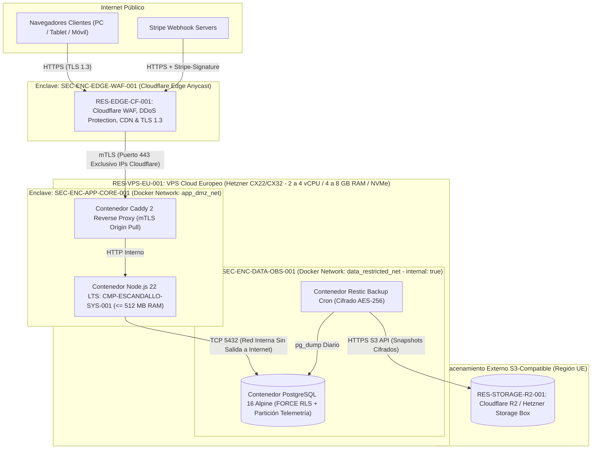

# 07. Deployment View (arc42 Sec. 7 / NAF Resource Deployment)

## 1. Infrastructure Topology and Network Enclaves (`ADR-001-COST-EFFECTIVE-DEPLOYMENT`)

Materializa la topología de despliegue más rentable y segura recomendada en `ADR-001-COST-EFFECTIVE-DEPLOYMENT`, mapeando los nodos físicos/virtuales sobre los tres enclaves de seguridad (`SEC-ENC-*`).

### 1.1 Deployment Topology Diagram

---

## 2. Node and Execution Resources Inventory (`RES-*`) & Cost Breakdown

| Resource ID | Node Type & Provider | Associated Enclave | Sizing (CPU / RAM / Disk) | Deployed Components | Monthly Cost (EUR, excl. IVA) |
| :--- | :--- | :--- | :--- | :--- | :---: |
| `RES-EDGE-CF-001` | Edge WAF, Anycast DNS, DDoS & CDN (**Cloudflare Plan Free / Pro**) | `SEC-ENC-EDGE-WAF-001` | Global Anycast Network | `CMP-WEB-UI-001` (Static Assets Cache & WAF Rules) | **0,00 EUR/mes** (Free) |
| `RES-VPS-EU-001` | Instancia Cloud KVM (**Hetzner Cloud CX22 / CX32** — Región Alemania/Finlandia UE) | `SEC-ENC-APP-CORE-001`, `SEC-ENC-DATA-OBS-001` | 2 a 4 vCPU / 4 a 8 GB RAM / 40–80 GB NVMe RAID10 + Snapshot | `CMP-ESCANDALLO-SYS-001` (`IAM`, `ENGINE`, `DOC`, `BILL`, `OBS`) + `PostgreSQL 16` | **~4,50 a 8,50 EUR/mes** |
| `RES-STORAGE-R2-001` | Object Storage S3-Compatible (**Cloudflare R2** — Jurisdicción UE) | `SEC-ENC-DATA-OBS-001` | Hasta 10 GB de backups comprimidos y cifrados (`restic`) | Copias de seguridad diarias de PostgreSQL y logs de auditoría | **0,00 EUR/mes** (10 GB Free) |
| **TOTAL TCO** | **Infraestructura Completa de Producción (1 a 150 Centros)** | — | — | **Rentable desde la 1ª suscripción de 14,90 EUR/mes** | **~5,50 a 9,50 EUR/mes** |

---

## 3. Network Policies and Hardening Controls

- **Firewall de Hipervisor (Zero Direct Exposure)**: El firewall de red del proveedor VPS bloquea el 100% del tráfico entrante salvo el puerto `443/tcp` originado exclusivamente desde las subredes IPv4/IPv6 oficiales de Cloudflare y administra el acceso de mantenimiento por SSH con clave Ed25519 / Tailscale VPN privada.
- **Aislamiento de Red de Base de Datos (`internal: true`)**: El contenedor de PostgreSQL 16 se ejecuta en una red puente Docker marcada como `internal: true`, sin interfaz expuesta al host (`127.0.0.1` ni `0.0.0.0`) y sin ruta de salida a Internet.

---

## 4. Revision History and Version Control

| Version | Date | Author / Agent | Change Description | Change Reference (Change/PR) |
| :--- | :--- | :--- | :--- | :--- |
| **1.0.0** | 2026-10-05 | agent-system-architect | Definición inicial de la vista de despliegue y presupuesto TCO | ARCH-INIT-001 |
