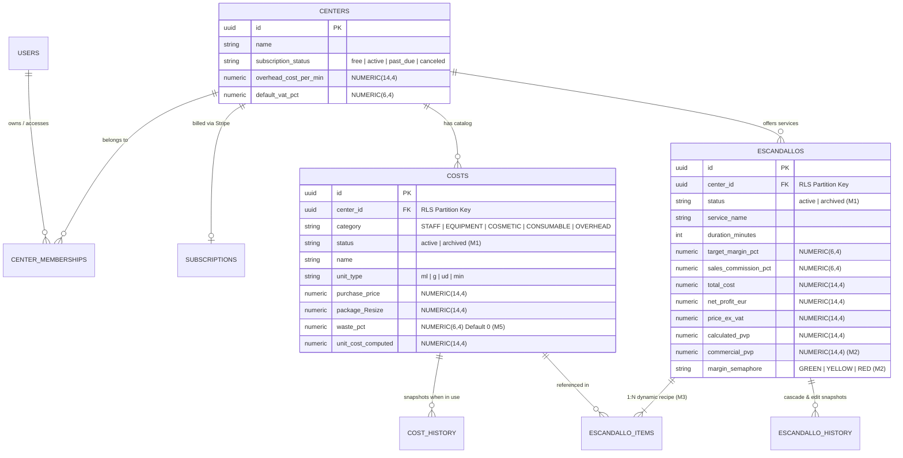

# 08. Cross-Cutting Concepts (arc42 Sec. 8 / NAF Information & Security)

## 1. Cross-Cutting Data Model with PostgreSQL Row-Level Security (`DATA-RELATIONAL-RLS-001`)

El modelo relacional implementa aislamiento por centro (`center_id`), ciclo de vida con baja lógica (`status IN ('active', 'archived')`, **M1**), recetas dinámicas $1:N$ (**M3**), precios comerciales con semáforo de margen (**M2**), merma de cabina (**M5**) e histórico inmutable condicional (`BR-RECALC-HISTORY-001`):

---

## 2. Binding Security Policies (`SEC-POL-*`)

| Policy ID | Scope | Satisfied Requirements | Control Description |
| :--- | :--- | :--- | :--- |
| `SEC-POL-RLS-001` | PostgreSQL 16 & API Middleware | `FR-TENANT-001`, `SEC-REQ-TENANT-001`, `SEC-REQ-BILLING-001` | `ALTER TABLE ... FORCE ROW LEVEL SECURITY` con predicado `center_id = current_setting('app.current_center_id')::uuid` y bloqueo pesimista `SELECT ... FOR UPDATE` en `centers` al activar escandallos. |
| `SEC-POL-REDACT-002` | Tubería de Observabilidad | `FR-OBS-001`, `SEC-REQ-OBS-001` | Serializador `pino` con ofuscación inmutable `[REDACTED]` sobre credenciales, cookies y firmas incluso en nivel `DEBUG`, y saneamiento de saltos de línea `\r\n`. |
| `SEC-POL-XLSX-SAFE-003` | Importador y Exportador Documental | `FR-REPORT-001`, `SEC-REQ-XLSX-001`, `SEC-REQ-DOS-001` | Límite `2 MB` comprimido / `10 MB` descomprimido (`ratio <= 20:1`), bloqueo de DTD/XXE, escape de prefijos `=+-@` y semáforo de máx. 2 exportaciones simultáneas por centro. |

---

## 3. Observability, Metrics, and Hot-Reloadable Severity (`DATA-TELEMETRY-JSON-002`)

- **Trazabilidad Distribuida**: Propagación de cabecera `traceparent` (W3C Trace Context) mediante `@opentelemetry/sdk-node`.
- **Niveles Soportados en Caliente**: `DEBUG`, `INFO`, `WARN`, `ERROR`, `SECURITY` actualizables vía `PUT /api/v1/admin/observability/log-level` sin reiniciar el proceso.
- **Formatos de Extracción Dual**: Descarga bajo demanda en `JSON`, `CSV` y `OTLP` desde la consola web del mantenedor y exportación en streaming OTLP/HTTP hacia colectores externos.

---

## 4. Revision History and Version Control

| Version | Date | Author / Agent | Change Description | Change Reference (Change/PR) |
| :--- | :--- | :--- | :--- | :--- |
| **1.0.0** | 2026-10-05 | agent-system-architect | Definición inicial de conceptos transversales, ER multi-tenant y políticas RLS | ARCH-INIT-001 |
