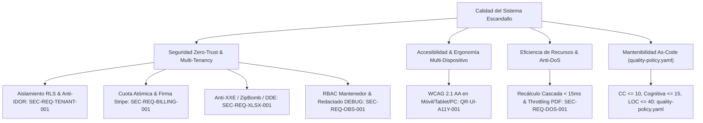

# 10. Quality Requirements (arc42 Sec. 10 / NAF Quality)

## 1. Quality Tree (ISO/IEC 25010)

---

## 2. Assessable Quality Scenarios

| Requirement ID | ISO Attribute | Stimulus and Environment | System Response | Objective Measure |
| :--- | :--- | :--- | :--- | :--- |
| `QR-UI-A11Y-001` | Usability / Accessibility | Uso en cabina con tablet (`768px`) y móvil (`360px`) o navegación por teclado | Adaptación fluida sin scroll horizontal, botones táctiles amplios y anuncios ARIA | `0` violaciones WCAG 2.1 AA, targets $\ge 44\times 44\text{ px}$, contraste $\ge 4.5:1$ |
| `QR-SEC-001`, `SEC-REQ-TENANT-001` | Security (Confidentiality) | Intento de copia de catálogo `M4` o descarga de informe apuntando a un `center_id` ajeno | Rechazo en capa IAM y bloqueo por política `FORCE RLS` en PostgreSQL | `100%` peticiones rechazadas (`403`/`404`) + traza `SECURITY` en $< 5\text{ ms}$ |
| `SEC-REQ-BILLING-001` | Security (Integrity) | 20 peticiones paralelas de creación/desarchivado de escandallo en plan gratuito | Serialización mediante `SELECT ... FOR UPDATE` sobre la fila del centro | Exactamente $\le 2$ escandallos en estado `active`; resto recibe `HTTP 402` |
| `SEC-REQ-XLSX-001` | Security (Resilience) | Subida de archivo `.xlsx` con bomba de descompresión (`>10 MB`) o fórmula `=CMD...` | Aborto previo en inspector ZIP o neutralización de prefijo ejecutable | Consumo RAM $< 20\text{ MB}$, respuesta `HTTP 422` o celda escapada como texto |
| `SEC-REQ-DOS-001` | Performance / Availability | Ráfaga de $>2$ exportaciones PDF simultáneas o $>30$ recálculos en cascada/minuto | Activación de semáforo de concurrencia y limitador de tasa por inquilino | Rechazo `HTTP 429` con `Retry-After`; memoria total del proceso $\le 512\text{ MB}$ |
| `SEC-REQ-OBS-001` | Security (Non-Repudiation) | Mantenedor activa modo `DEBUG` en caliente y exporta logs tras inicios de sesión | Ofuscación automática de cabeceras y secretos antes de persistir o exportar | `0` credenciales en claro (`[REDACTED]`) y registro inmutable del cambio de nivel |

---

## 3. Revision History and Version Control

| Version | Date | Author / Agent | Change Description | Change Reference (Change/PR) |
| :--- | :--- | :--- | :--- | :--- |
| **1.0.0** | 2026-10-05 | agent-system-architect | Definición inicial del árbol de calidad y escenarios medibles | ARCH-INIT-001 |
