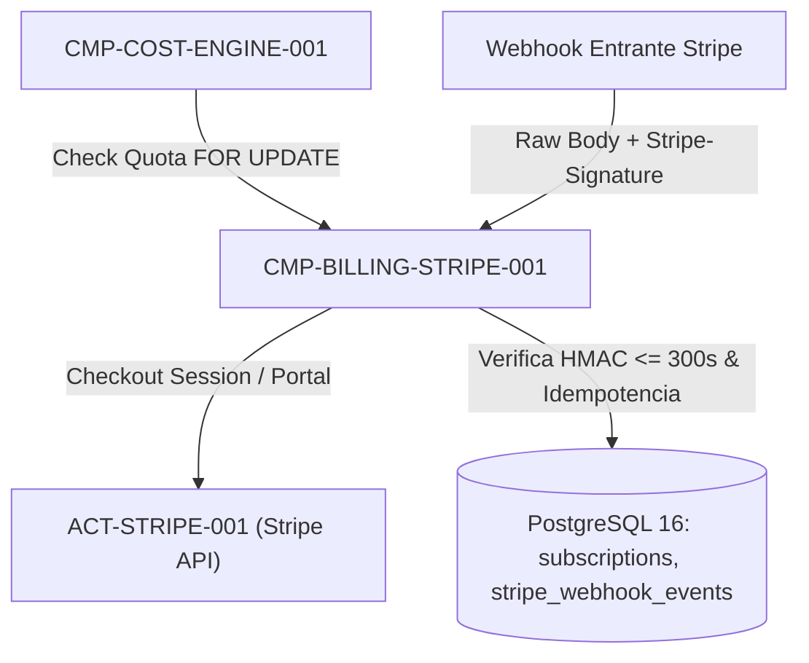

# CMP-BILLING-STRIPE-001: Módulo de Suscripciones, Control Atómico de Cuota Freemium e Integración con Stripe

## 1. Purpose, Responsibility, and Bounded Context

Subsistema de monetización y control de licencias de Nivel 2 (`ADR-003-MULTITENANT-RLS-AND-ATOMIC-QUOTA`) responsable de hacer cumplir `BR-FREEMIUM-QUOTA-001`, `FR-BILLING-001` y `SEC-REQ-BILLING-001`:
1. **Control Atómico de Cuota Gratuita (2 Escandallos `active` por Usuario y Centro)**: Adquiere bloqueo exclusivo de fila (`SELECT ... FOR UPDATE` sobre `centers`) antes de permitir la creación, duplicación (`M4`) o reactivación desde `archived` (`M1`) de un escandallo, impidiendo condiciones de carrera concurrentes.
2. **Política de Exceso Post-Cancelación (`M1`)**: Si la suscripción de un centro pasa a `canceled` / `unpaid` / `past_due` mientras tiene $>2$ escandallos en estado `active`, bloquea toda creación, duplicación, edición y exportación hasta que el usuario archive el exceso dejando $\le 2$ activos o reactive su suscripción.
3. **Planes de Suscripción y Webhooks Verificados en Stripe**: Gestiona sesiones de Stripe Checkout para el **Plan Mensual (`14,90 EUR/mes` + IVA)** y **Plan Anual (`149,00 EUR/año` + IVA)** por centro de estética, validando criptográficamente `Stripe-Signature` (HMAC-SHA256, tolerancia máxima de `300 segundos`) y garantizando idempotencia por `event.id`.

## 2. Structure and Connectivity Diagram (arc42 Sec. 5 / NAF v4)

## 3. Interface Contracts and Execution Policies

- **Execution Mechanism**: Servicio transaccional en proceso y receptor de webhooks dedicado con parseo de cuerpo crudo (`rawBody`) para verificación HMAC-SHA256.
- **Fault Tolerance and Performance**: Idempotencia garantizada mediante restricción `PRIMARY KEY (event_id)` en `stripe_webhook_events`; rechazo inmediato (`HTTP 400`) ante firmas ausentes, inválidas o con timestamp expirado ($>300\text{ s}$).

---

## 4. Revision History and Version Control

| Version | Date | Author / Agent | Change Description | Change Reference (Change/PR) |
| :--- | :--- | :--- | :--- | :--- |
| **1.0.0** | 2026-10-05 | agent-system-architect | Definición inicial del módulo de facturación Stripe y cuota freemium | ARCH-INIT-001 |
