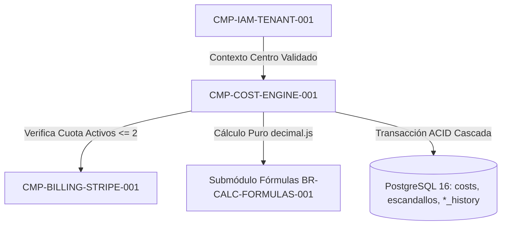

# CMP-COST-ENGINE-001: Motor de Catálogo de Costes, Fórmulas de Escandallo, Semáforo de Margen y Recálculo en Cascada

## 1. Purpose, Responsibility, and Bounded Context

Núcleo de dominio financiero de Nivel 2 (`ADR-004-EXACT-DECIMAL-AND-CASCADE-ENGINE`) que implementa con aritmética decimal exacta (`decimal.js`) todas las fórmulas de costes base y escandallos (`BR-CALC-FORMULAS-001`) y la política de histórico inmutable y recálculo en cascada (`BR-RECALC-HISTORY-001`):
- **Catálogo de Costes y Merma (`FR-COST-001`, M1, M4, M5)**: Gestión de Personal (`Tabla1`), Aparatología (`Tabla2`), Cosméticos en `ml`/`g`/`ud` con asistente de dosis de cabina y `% Merma` (`Tabla3`), Consumibles (`Tabla25`), Gastos Generales (`Tabla13`) y Parámetros (`Tabla12`), copia rápida de catálogo entre centros del mismo propietario (`M4`) y baja lógica obligatoria (`archived`, `M1`) para costes con histórico.
- **Cálculo de Escandallo y Semáforo de Erosión (`FR-CALC-001`, M2, M3)**: Receta dinámica $1:N$ (hasta 100 líneas por servicio, `SEC-REQ-DOS-001`), duplicación en 1 clic (`M4`), cálculo de `Coste Total`, `Beneficio Neto (EUR)`, `Precio sin IVA`, `PVP Calculado`, simulación inversa con `PVP Comercial Fijado` y cálculo del **Semáforo de Erosión de Margen (`🟢/🟡/🔴`, M2)**.
- **Previsualización de Impacto y Recálculo en Cascada (`FR-HIST-001`, M3)**: Calcula antes de guardar cuántos escandallos ($N$) se verán afectados y, al confirmar, persiste atómicamente los snapshots históricos (`cost_history` y `escandallo_history`) solo cuando $N \ge 1$.

## 2. Structure and Connectivity Diagram (arc42 Sec. 5 / NAF v4)

## 3. Interface Contracts and Execution Policies

- **Execution Mechanism**: Servicios de dominio puros invocados dentro de transacciones PostgreSQL con aislamiento RLS activo.
- **Fault Tolerance and Performance**: Tiempo de recálculo en cascada $< 15\text{ ms}$ para 100 escandallos; rechazo inmediato (`HTTP 422`) de entradas numéricas `NaN`, `Infinity`, negativas o divisores `0`.

---

## 4. Revision History and Version Control

| Version | Date | Author / Agent | Change Description | Change Reference (Change/PR) |
| :--- | :--- | :--- | :--- | :--- |
| **1.0.0** | 2026-10-05 | agent-system-architect | Definición inicial del motor de costes, escandallos y recálculo en cascada | ARCH-INIT-001 |
