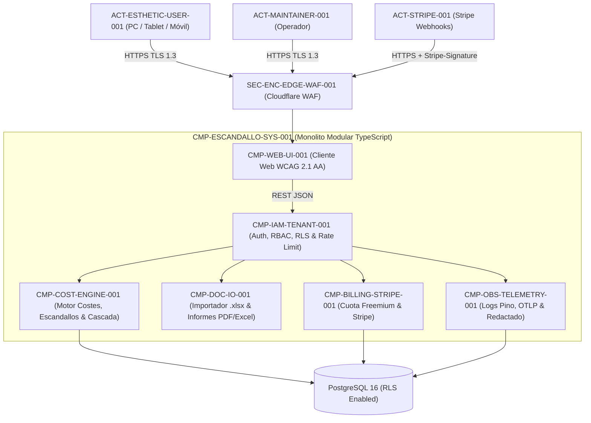

# CMP-ESCANDALLO-SYS-001: Plataforma SaaS Multi-Tenant de Escandallos y Rentabilidad para Centros de Estética (Sistema Raíz)

## 1. Purpose, Responsibility, and Bounded Context

Componente compuesto de Nivel 1 (Sistema Raíz) que encapsula el monolito modular de la plataforma SaaS de cálculo de escandallos, beneficios y PVP para centros de estética (`ADR-002-MODULAR-MONOLITH-STACK`), desplegado sobre la topología rentable Cloudflare Edge + VPS Cloud Europeo (`ADR-001-COST-EFFECTIVE-DEPLOYMENT`). Coordina los seis subsistemas de Nivel 2 garantizando aislamiento multi-tenant estricto (`SEC-REQ-TENANT-001`), exactitud aritmética (`ADR-004-EXACT-DECIMAL-AND-CASCADE-ENGINE`) y observabilidad dual (`ADR-005-DUAL-OBSERVABILITY-AND-SAFE-DOCUMENTS`).

## 2. Structure and Connectivity Diagram (arc42 Sec. 5 / NAF v4)

## 3. Interface Contracts and Execution Policies

- **Execution Mechanism**: Proceso contenedorizado Node.js 22 LTS gestionado por Docker Compose detrás de Caddy Reverse Proxy y Cloudflare Edge WAF.
- **Fault Tolerance and Performance**: Huella de memoria máxima acotada a `512 MB RAM` por contenedor de aplicación; latencia $p95 < 100\text{ ms}$ en operaciones de cálculo y recálculo en cascada.

---

## 4. Revision History and Version Control

| Version | Date | Author / Agent | Change Description | Change Reference (Change/PR) |
| :--- | :--- | :--- | :--- | :--- |
| **1.0.0** | 2026-10-05 | agent-system-architect | Definición inicial del componente raíz del sistema | ARCH-INIT-001 |
