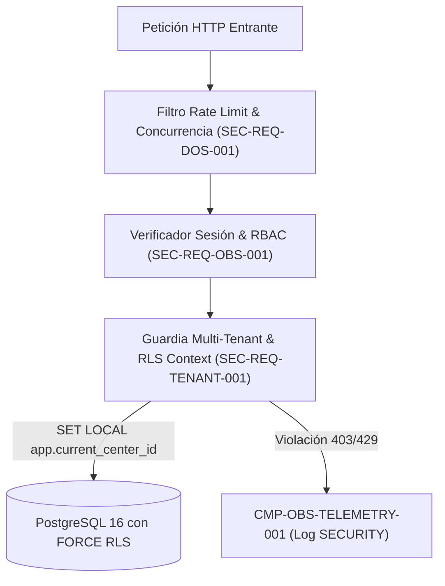

# CMP-IAM-TENANT-001: Módulo de Identidad, RBAC, Guardia Multi-Tenant RLS y Limitador de Tasa

## 1. Purpose, Responsibility, and Bounded Context

Subsistema transversal de seguridad de Nivel 2 (`ADR-003-MULTITENANT-RLS-AND-ATOMIC-QUOTA`) encargado de:
1. **Autenticación Segura**: Hash de credenciales con `Argon2id` y emisión de sesiones en cookies `HttpOnly; Secure; SameSite=Strict`.
2. **Autorización RBAC e Inmutabilidad de Rol (`SEC-REQ-OBS-001`)**: Separación estricta entre `ACT-ESTHETIC-USER-001` y `ACT-MAINTAINER-001`, bloqueando cualquier intento de *Mass Assignment* del campo `role` en registro o edición de perfil.
3. **Aislamiento Multi-Tenant con PostgreSQL RLS y Validación Dual `M4` (`FR-TENANT-001`, `SEC-REQ-TENANT-001`)**: Verifica la titularidad del `center_id` (y de `source_center_id` + `target_center_id` en copias de catálogo `M4`) e inyecta `SET LOCAL app.current_center_id` en cada transacción SQL.
4. **Throttling y Protección Anti-DoS (`SEC-REQ-DOS-001`)**: Aplica límites por inquilino e IP (`30 mutaciones con cascada/min`, `10 exportaciones/min`, `2 exportaciones concurrentes`).

## 2. Structure and Connectivity Diagram (arc42 Sec. 5 / NAF v4)

## 3. Interface Contracts and Execution Policies

- **Execution Mechanism**: Hooks de ciclo de vida de petición en Fastify (`onRequest`, `preHandler`) y wrapper transaccional obligatorio `withTenantTransaction(userId, centerId, fn)`.
- **Fault Tolerance and Performance**: Sobrecarga de validación $< 1.5\text{ ms}$ por petición; ante cualquier discrepancia de pertenencia entre `user_id` y `center_id`, aborta inmediatamente con `403 Forbidden` o `404 Not Found` y emite evento `SECURITY`.

---

## 4. Revision History and Version Control

| Version | Date | Author / Agent | Change Description | Change Reference (Change/PR) |
| :--- | :--- | :--- | :--- | :--- |
| **1.0.0** | 2026-10-05 | agent-system-architect | Definición inicial del módulo IAM, RLS y Rate Limiting | ARCH-INIT-001 |
