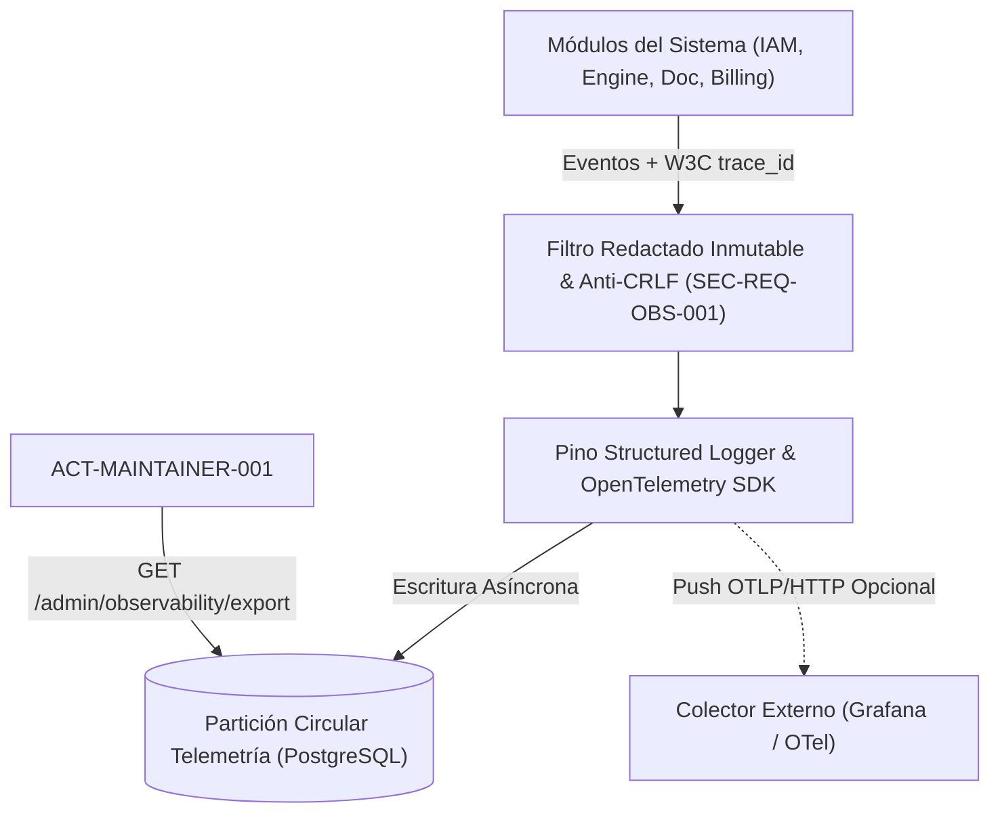

# CMP-OBS-TELEMETRY-001: Subsistema de Observabilidad Dual, Nivel de Log en Caliente, Redactado de Secretos y Consola de Mantenedor

## 1. Purpose, Responsibility, and Bounded Context

Subsistema de telemetría y auditoría de Nivel 2 (`ADR-005-DUAL-OBSERVABILITY-AND-SAFE-DOCUMENTS`) ubicado en el enclave restringido `SEC-ENC-DATA-OBS-001`, que satisface `FR-OBS-001` y `SEC-REQ-OBS-001`:
1. **Emisión Estructurada Estándar con Redactado Inmutable**: Genera logs JSON de una sola línea (`pino` `MIT`), trazas distribuidas W3C (`trace_id`, `span_id` con `@opentelemetry/sdk-node` `Apache-2.0`) y métricas RED/sistema, aplicando un filtro de ofuscación inmutable (`[REDACTED]`) sobre tokens, cookies, contraseñas, firmas de Stripe e IBAN incluso cuando el nivel activo es `DEBUG`.
2. **Granularidad Configurable en Caliente Sin Reinicio**: Permite al `ACT-MAINTAINER-001` conmutar en tiempo de ejecución el nivel de severidad (`DEBUG`, `INFO`, `WARN`, `ERROR`, `SECURITY`), registrando cada cambio como un evento de auditoría inmutable de nivel `SECURITY`.
3. **Extracción Dual (UI Web + Stack Externo)**: Permite consultar y descargar logs, trazas y métricas desde la consola web del mantenedor en formatos `JSON`, `CSV` y `OTLP`, además de soportar envío estándar OTLP/HTTP hacia colectores externos (ej. Grafana Cloud / Prometheus).

## 2. Structure and Connectivity Diagram (arc42 Sec. 5 / NAF v4)

## 3. Interface Contracts and Execution Policies

- **Execution Mechanism**: Logger asíncrono no bloqueante en memoria con volcado por lotes (*batching*) a almacenamiento rotativo y endpoints administrativos protegidos por RBAC exclusivo de `ACT-MAINTAINER-001`.
- **Fault Tolerance and Performance**: Sobrecarga de logging $< 0.2\text{ ms}$ por petición; escape automático de caracteres de control (`\r`, `\n`, `\t`) para neutralizar ataques de *Log Forgery*.

---

## 4. Revision History and Version Control

| Version | Date | Author / Agent | Change Description | Change Reference (Change/PR) |
| :--- | :--- | :--- | :--- | :--- |
| **1.0.0** | 2026-10-05 | agent-system-architect | Definición inicial del subsistema de observabilidad dual y redactado de secretos | ARCH-INIT-001 |
