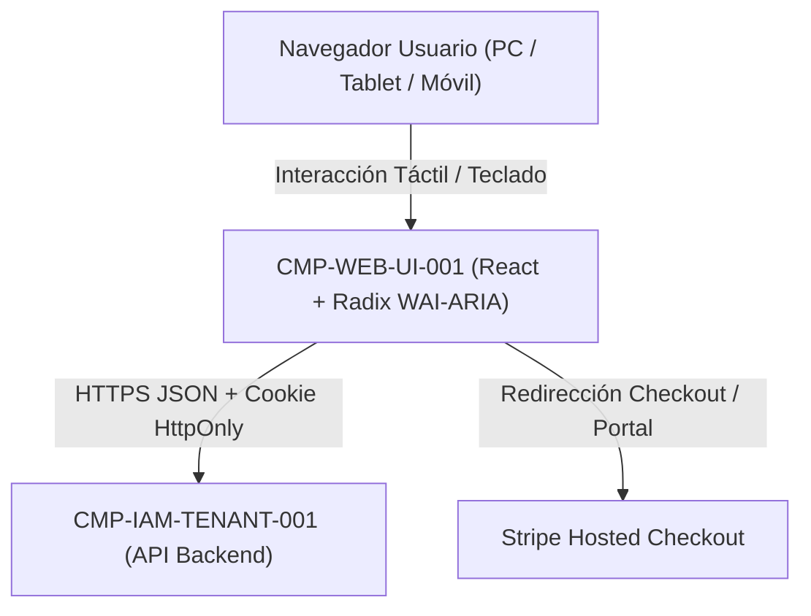

# CMP-WEB-UI-001: Cliente Web Adaptativo y Accesible (SPA/SSR Responsive UI para PC, Tablet y Móvil)

## 1. Purpose, Responsibility, and Bounded Context

Subsistema de presentación de Nivel 2 construido en React 19 + TypeScript + TailwindCSS + primitivas accesibles Radix UI (`MIT`), responsable de ofrecer una experiencia ergonómica y sin scroll horizontal en móvil (`320px–767px`), tablet en cabina (`768px–1023px`, vertical y horizontal) y escritorio (`>=1024px`), cumpliendo el estándar **WCAG 2.1 Nivel AA** (`QR-UI-A11Y-001`).

Implementa en interfaz las mejoras clave de MVP:
- **M1**: Filtros de estado `active` / `archived` y asistente de resolución de bloqueo post-cancelación de suscripción.
- **M2**: Simulador en vivo de `PVP Comercial Fijado` frente a `PVP Calculado` y **Semáforo de Erosión de Margen (`🟢/🟡/🔴`)**.
- **M3**: Constructor dinámico de recetas $1:N$ y modal de confirmación con **previsualización de impacto** (*"Este cambio recalculará N escandallos"*).
- **M4**: Onboarding en 1 clic con catálogo semilla, carga de plantilla `.xlsx`, botón *"Duplicar Escandallo"* y selector de copia de catálogo entre centros propios.
- **M5**: Asistente visual de equivalencias de dosis de cabina (pulsaciones, gotas, cucharaditas $\rightarrow$ `ml`/`g`) y control de `% Merma`.

## 2. Structure and Connectivity Diagram (arc42 Sec. 5 / NAF v4)

## 3. Interface Contracts and Execution Policies

- **Execution Mechanism**: Activos estáticos inmutables servidos con caché en el borde por Cloudflare CDN (`SEC-ENC-EDGE-WAF-001`) y comunicación API REST JSON con el backend.
- **Fault Tolerance and Performance**: Áreas táctiles mínimas de `44x44 px`, contraste $\ge 4.5:1$, navegación completa por teclado (`Tab`, `Enter`, `Escape`), y regiones `aria-live="polite"` para anunciar recálculos de PVP y cambios del semáforo de margen a lectores de pantalla.

---

## 4. Revision History and Version Control

| Version | Date | Author / Agent | Change Description | Change Reference (Change/PR) |
| :--- | :--- | :--- | :--- | :--- |
| **1.0.0** | 2026-10-05 | agent-system-architect | Definición inicial del cliente web accesible y adaptativo | ARCH-INIT-001 |
